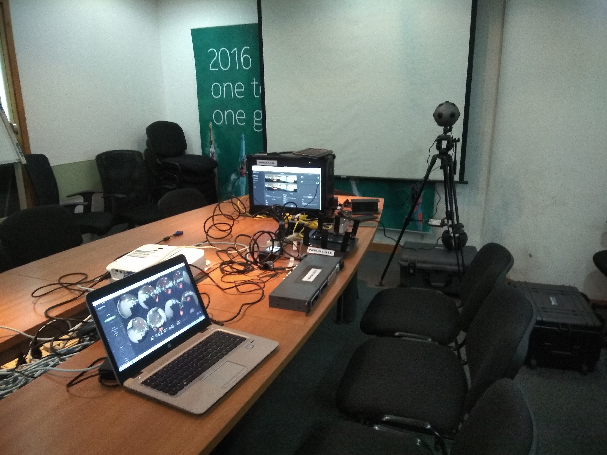
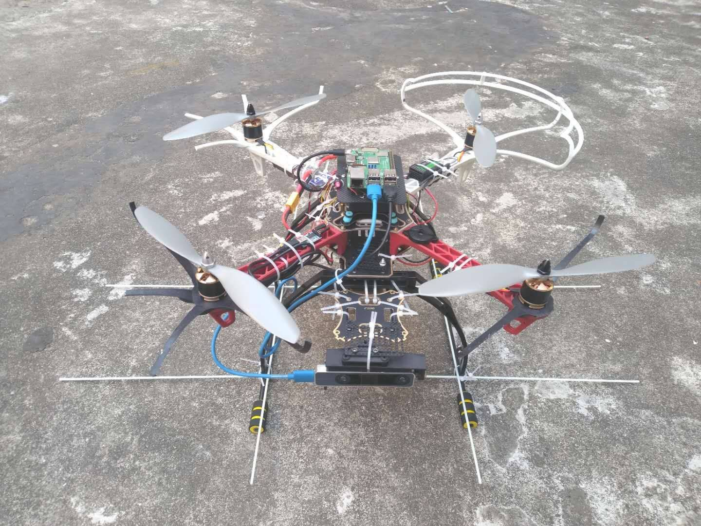
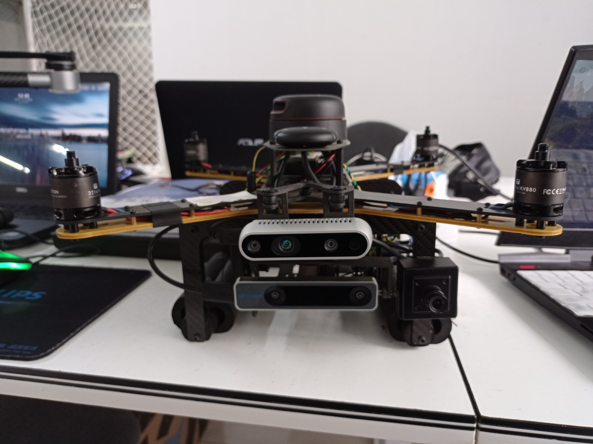
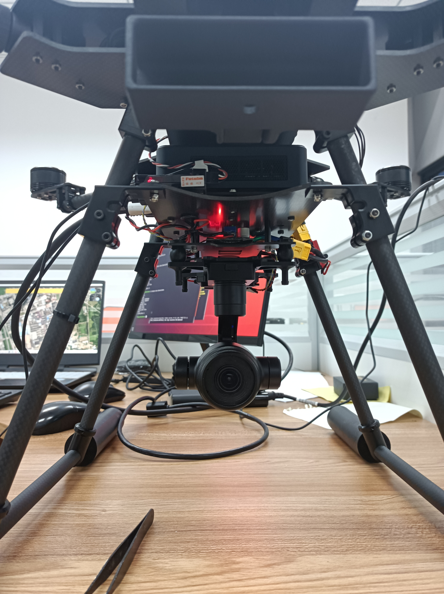
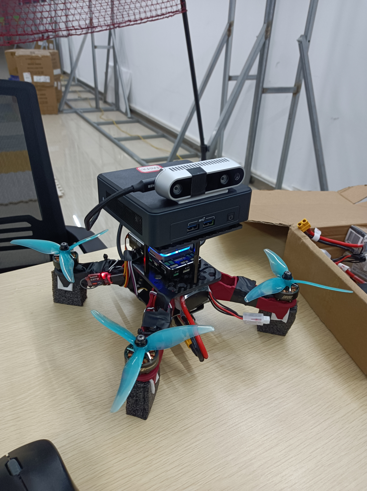
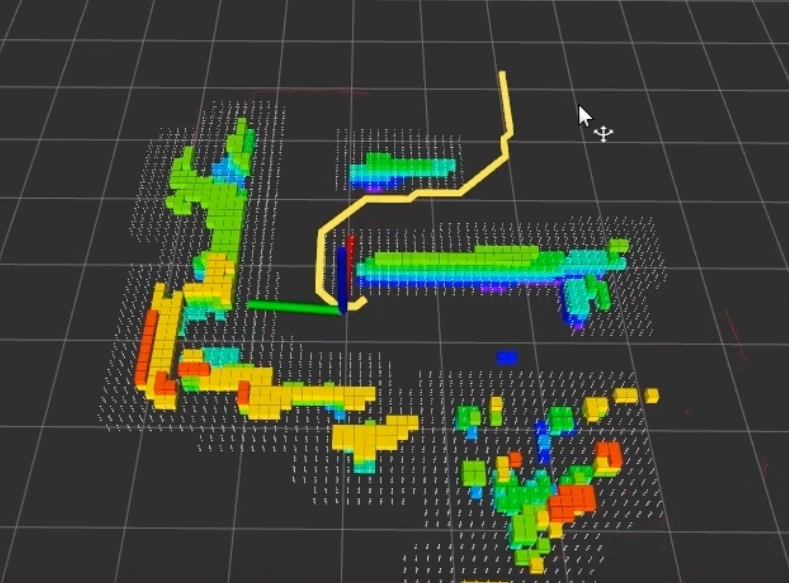
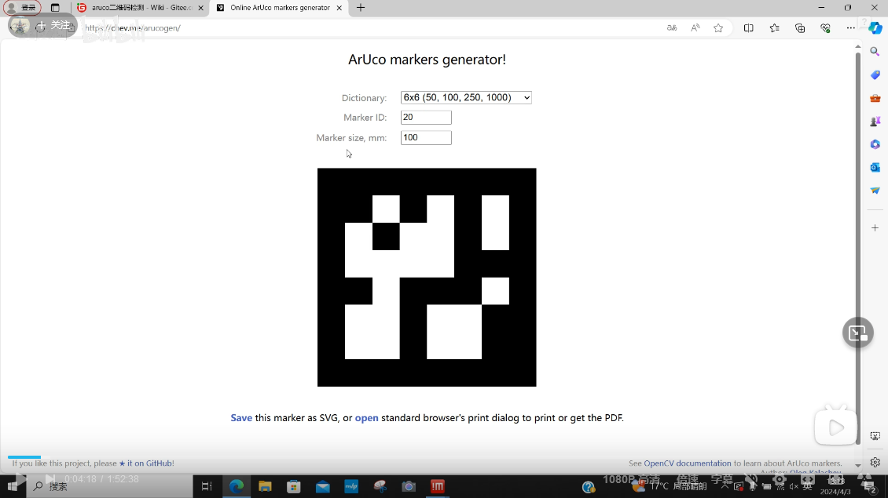
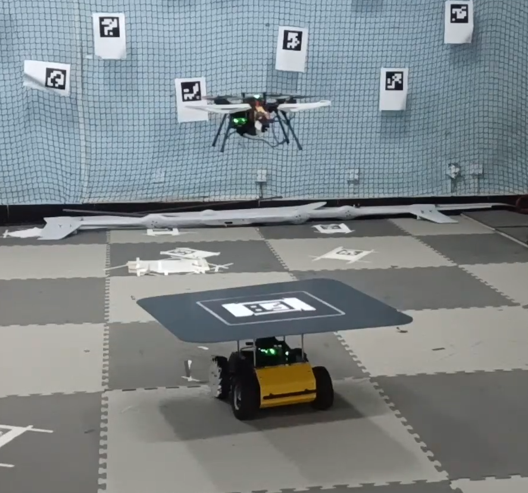

## Hi there 👋

<!--
**maxibooksiyi/maxibooksiyi** is a ✨ _special_ ✨ repository because its `README.md` (this file) appears on your GitHub profile.

Here are some ideas to get you started:

- 🔭 I’m currently working on ...
- 🌱 I’m currently learning ...
- 👯 I’m looking to collaborate on ...
- 🤔 I’m looking for help with ...
- 💬 Ask me about ...
- 📫 How to reach me: ...
- 😄 Pronouns: ...
- ⚡ Fun fact: ...
-->

## 项目 
### NOKIA OZO  
 

### APM T265 

### ACFLY T265  

### P200  

<!--  -->  

<!--  -->    

### 改良的无人机astar  
  

<!--  -->

<!--
aruco二维码检测定位原理讲解及基于opencv的代码和ros功能包实现  
   
-->  

  

## SLAM  

把RTPL-VIO的前端由EDLines改为MLSD  
https://www.bilibili.com/video/BV1ux421f7kf/   

把基于opencv4的vins-mono前端改为superpoint+光流  
https://www.bilibili.com/video/BV1SH4y1E7Mc/  

把ego的plan_env模块单独取出订阅位姿和深度图构建自己可用的导航地图  
https://www.bilibili.com/video/BV1nZ421b7Ta/  

## 讲解 
基于T265或vins px4定点指点原理讲解与gazebo仿真演示  
https://www.bilibili.com/video/BV1zm421n7MR/  

aruco二维码检测定位原理讲解及基于opencv的代码和ros功能包实现  
https://www.bilibili.com/video/BV1wD421W7tT/  

aruco二维码降落原理与代码讲解及gazebo仿真演示  
https://www.bilibili.com/video/BV1VE421T7wJ/  

无人机SLAM与运动规划  
https://www.bilibili.com/video/BV1eJ4m1s7JY/  
